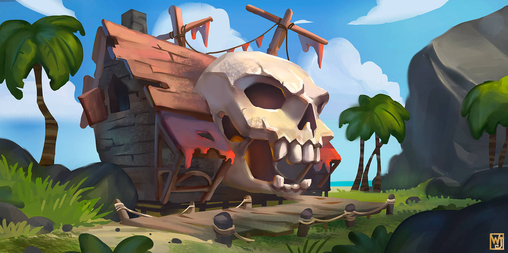
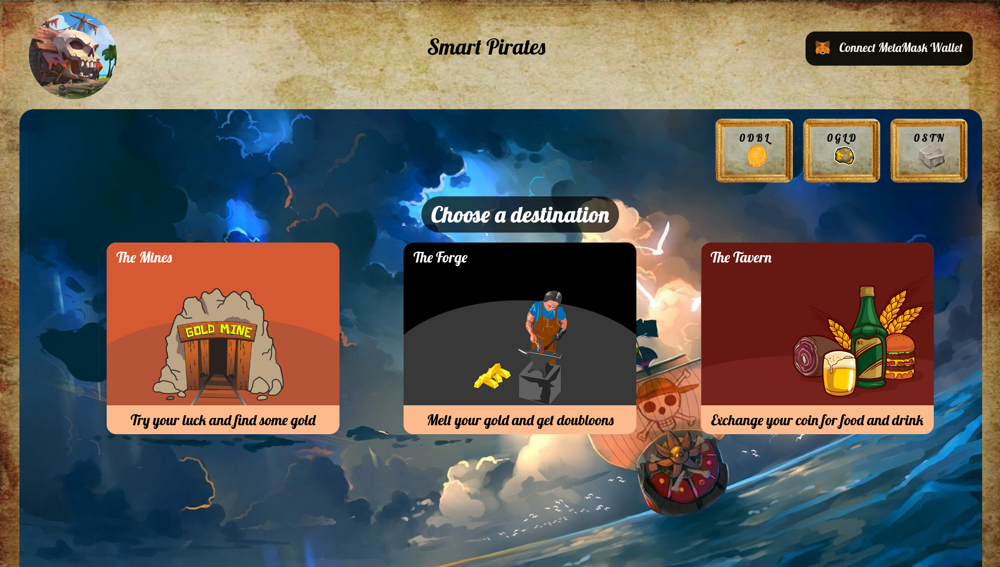
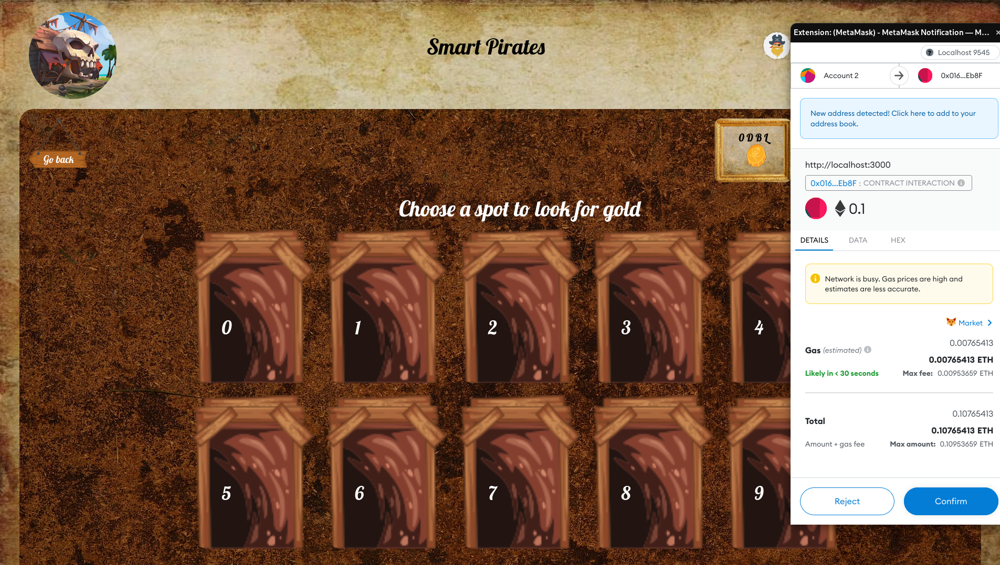
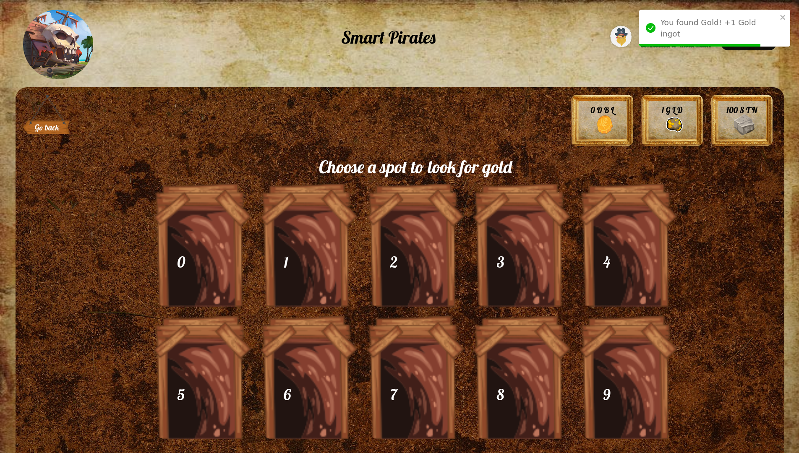
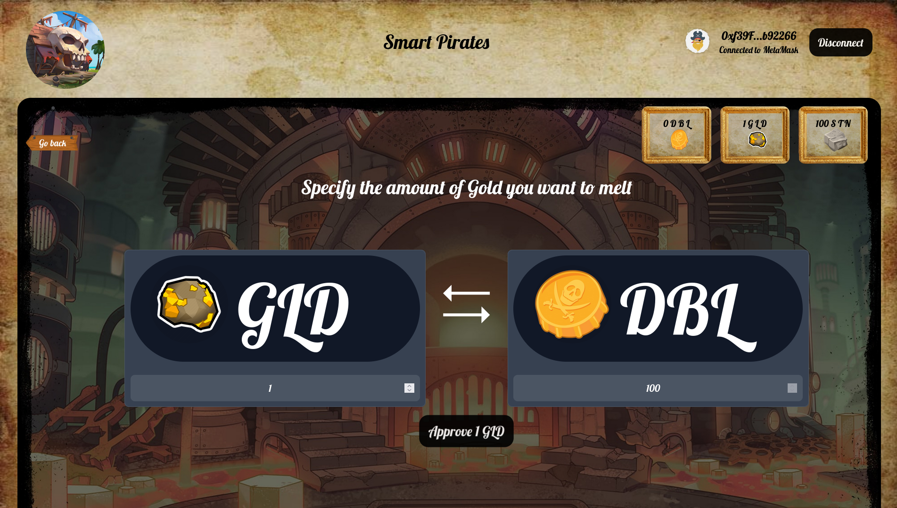
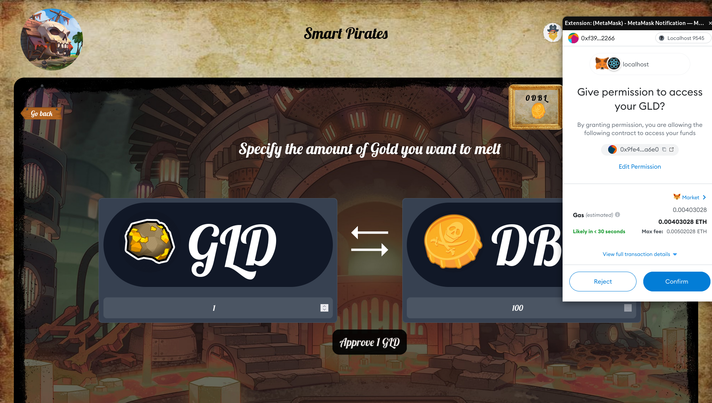
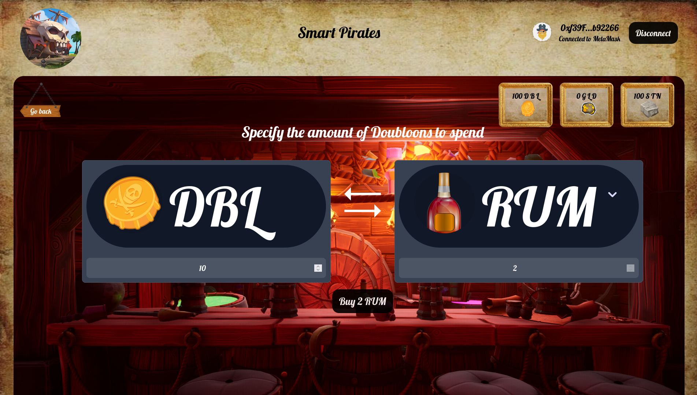
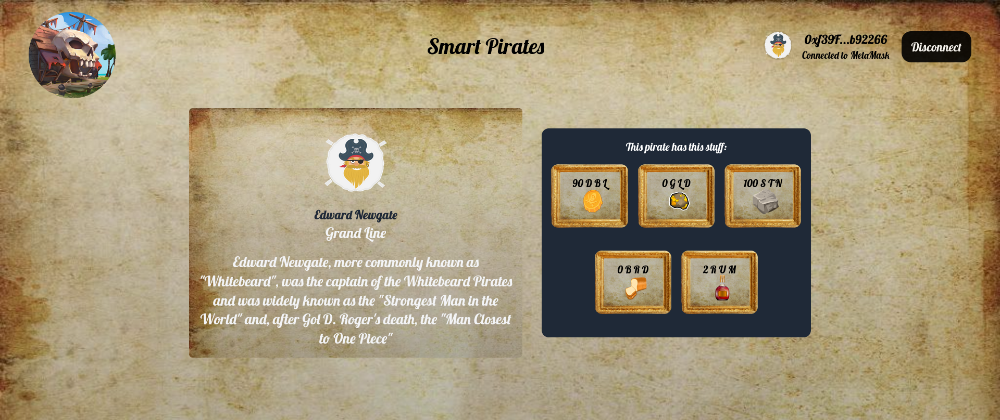
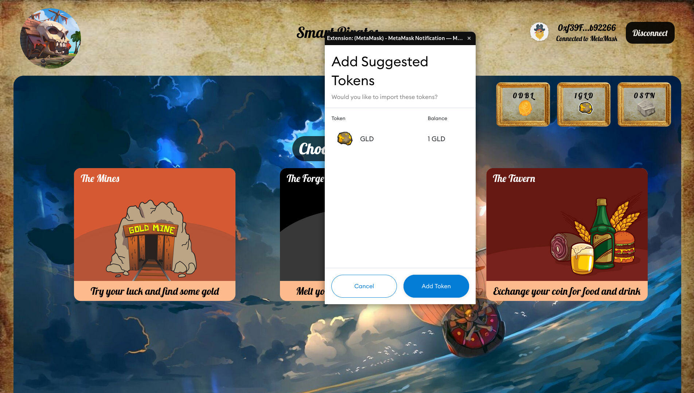

  

<h1 align="center">Pirate Journey</h1>

This project follows the monorepo architecture using yarn workspaces.

Contents:

- smart-contracts: Package with smart contracts
- dapp: Frontend made in React.js that interacts with the deployed contracts

## Instructions

At the root of the project, run `yarn install` in order to install all the dependencies.

Then execute the following commands:

- `yarn sc hardhat compile` in order to compile the smart contracts

- `yarn sc hardhat node` in order to spin up a local ethereum node, this is the same as ganache but without a GUI.

- `yarn sc deploy:all` this will deploy all the smart contracts, and copy their ABIS and the address that they were deployed to, to the dapp package.

And finally, run the dapp:

`yarn dapp start`

That's it! Head over to http://localhost:3000

## Screenshots

### Home

### Connected with Metamask

### The Mines

#### Exploring the mine

The minigame consists on choosing a spot to mine in, you might find gold or stones. In order to mine you need to pay a fee in ETH as shown in the metamask pop-up.

##### Being lucky

### The Forge

##### Swap Approval of GLD for DBL 

### The Tavern

Here you can buy Rum and Bread

### Your Profile

### Adding tokens to metamask

